# Priority 1 Implementation Plan: Boarding Points, Dropping Points, and Dynamic Pricing

## Overview

This plan implements the three critical features identified in the Route Management audit:
1. **Boarding Points Management** - Detailed pickup locations with GPS, landmarks, and pickup times
2. **Dropping Points Management** - Detailed drop-off locations with GPS, landmarks, and drop-off times
3. **Dynamic Pricing Rules** - Demand-based pricing with surge, early bird, and last-minute rules

---

## Architecture Overview

```mermaid
graph TB
    subgraph Database
        Route[Route]
        BoardingPoint[BoardingPoint]
        DroppingPoint[DroppingPoint]
        DynamicPricingRule[DynamicPricingRule]
        RouteBoardingPoint[RouteBoardingPoint]
        RouteDroppingPoint[RouteDroppingPoint]
    end
    
    subgraph Admin Controllers
        AdminBoardingPoint[Admin/BoardingPointController]
        AdminDroppingPoint[Admin/DroppingPointController]
        AdminDynamicPricing[Admin/DynamicPricingController]
    end
    
    subgraph Owner Controllers
        OwnerBoardingPoint[Owner/BoardingPointController]
        OwnerDroppingPoint[Owner/DroppingPointController]
        OwnerDynamicPricing[Owner/DynamicPricingController]
    end
    
    Route -->|has many| RouteBoardingPoint
    Route -->|has many| RouteDroppingPoint
    Route -->|has many| DynamicPricingRule
    BoardingPoint -->|has many| RouteBoardingPoint
    DroppingPoint -->|has many| RouteDroppingPoint
    RouteBoardingPoint -->|belongs to| BoardingPoint
    RouteDroppingPoint -->|belongs to| DroppingPoint
    
    AdminBoardingPoint -->|manages| BoardingPoint
    AdminDroppingPoint -->|manages| DroppingPoint
    AdminDynamicPricing -->|manages| DynamicPricingRule
    OwnerBoardingPoint -->|manages| BoardingPoint
    OwnerDroppingPoint -->|manages| DroppingPoint
    OwnerDynamicPricing -->|manages| DynamicPricingRule
```



---

## Part 1: Boarding Points Management

### 1.1 Database Schema

#### Migration: `create_boarding_points_table`

```php
Schema::create('boarding_points', function (Blueprint $table) {
    $table->id();
    $table->foreignId('owner_id')->nullable()->constrained('owners')->onDelete('cascade');
    $table->foreignId('city_id')->nullable()->constrained('cities')->onDelete('set null');
    $table->foreignId('counter_id')->nullable()->constrained('counters')->onDelete('set null');
    $table->string('name');
    $table->text('landmark')->nullable();
    $table->text('description')->nullable();
    $table->string('address')->nullable();
    $table->decimal('latitude', 10, 8)->nullable();
    $table->decimal('longitude', 11, 8)->nullable();
    $table->string('contact_phone')->nullable();
    $table->string('contact_email')->nullable();
    $table->enum('type', ['bus_stand', 'highway_pickup', 'city_center', 'airport', 'custom'])->default('bus_stand');
    $table->boolean('is_active')->default(true);
    $table->integer('sort_order')->default(0);
    $table->timestamps();
    $table->softDeletes();
});
```

#### Migration: `create_route_boarding_points_table`

```php
Schema::create('route_boarding_points', function (Blueprint $table) {
    $table->id();
    $table->foreignId('route_id')->constrained('routes')->onDelete('cascade');
    $table->foreignId('boarding_point_id')->constrained('boarding_points')->onDelete('cascade');
    $table->integer('pickup_time_offset')->default(0); // Minutes from route start
    $table->integer('sort_order')->default(0);
    $table->timestamps();
    
    $table->unique(['route_id', 'boarding_point_id']);
});
```

### 1.2 Model: `BoardingPoint`

```php
<?php

namespace App\Models;

use App\Traits\GlobalStatus;
use Illuminate\Database\Eloquent\Model;

class BoardingPoint extends Model
{
    use GlobalStatus;

    protected $fillable = [
        'owner_id',
        'city_id',
        'counter_id',
        'name',
        'landmark',
        'description',
        'address',
        'latitude',
        'longitude',
        'contact_phone',
        'contact_email',
        'type',
        'is_active',
        'sort_order',
    ];

    protected $casts = [
        'is_active' => 'boolean',
        'latitude' => 'decimal:8',
        'longitude' => 'decimal:8',
    ];

    // Types
    const TYPE_BUS_STAND = 'bus_stand';
    const TYPE_HIGHWAY_PICKUP = 'highway_pickup';
    const TYPE_CITY_CENTER = 'city_center';
    const TYPE_AIRPORT = 'airport';
    const TYPE_CUSTOM = 'custom';

    public function owner()
    {
        return $this->belongsTo(Owner::class);
    }

    public function city()
    {
        return $this->belongsTo(City::class);
    }

    public function counter()
    {
        return $this->belongsTo(Counter::class);
    }

    public function routes()
    {
        return $this->belongsToMany(Route::class, 'route_boarding_points')
            ->withPivot('pickup_time_offset', 'sort_order')
            ->orderBy('pivot_sort_order');
    }

    public function scopeActive($query)
    {
        return $query->where('is_active', true);
    }

    public function scopeByCity($query, $cityId)
    {
        return $query->where('city_id', $cityId);
    }

    public function scopeByOwner($query, $ownerId)
    {
        return $query->where('owner_id', $ownerId);
    }

    public function getTypeLabelAttribute()
    {
        $labels = [
            self::TYPE_BUS_STAND => 'Bus Stand',
            self::TYPE_HIGHWAY_PICKUP => 'Highway Pickup',
            self::TYPE_CITY_CENTER => 'City Center',
            self::TYPE_AIRPORT => 'Airport',
            self::TYPE_CUSTOM => 'Custom',
        ];
        return $labels[$this->type] ?? 'Unknown';
    }

    public function getFullAddressAttribute()
    {
        $parts = [];
        if ($this->name) $parts[] = $this->name;
        if ($this->landmark) $parts[] = $this->landmark;
        if ($this->address) $parts[] = $this->address;
        return implode(', ', $parts);
    }
}
```

### 1.3 Update Route Model

```php
// Add to Route model
public function boardingPoints()
{
    return $this->belongsToMany(BoardingPoint::class, 'route_boarding_points')
        ->withPivot('pickup_time_offset', 'sort_order')
        ->orderBy('pivot_sort_order');
}
```

### 1.4 Admin Controller: `Admin/BoardingPointController`

```php
<?php

namespace App\Http\Controllers\Admin;

use App\Http\Controllers\Controller;
use App\Models\BoardingPoint;
use App\Models\Route;
use Illuminate\Http\Request;

class BoardingPointController extends Controller
{
    public function index()
    {
        $pageTitle = __('All Boarding Points');
        $boardingPoints = BoardingPoint::query()
            ->with(['owner', 'city', 'counter'])
            ->searchable(['name', 'landmark'])
            ->filter(['owner_id', 'city_id', 'type'])
            ->orderBy('sort_order')
            ->orderByDesc('id')
            ->paginate(getPaginate());

        return view('admin.boarding-points.index', compact('pageTitle', 'boardingPoints'));
    }

    public function create()
    {
        $pageTitle = __('Create Boarding Point');
        $cities = City::active()->orderBy('name')->get();
        $counters = Counter::active()->orderBy('name')->get();
        return view('admin.boarding-points.create', compact('pageTitle', 'cities', 'counters'));
    }

    public function store(Request $request)
    {
        $request->validate([
            'name' => 'required|string|max:255',
            'owner_id' => 'nullable|integer|exists:owners,id',
            'city_id' => 'nullable|integer|exists:cities,id',
            'counter_id' => 'nullable|integer|exists:counters,id',
            'landmark' => 'nullable|string|max:500',
            'description' => 'nullable|string|max:1000',
            'address' => 'nullable|string|max:500',
            'latitude' => 'nullable|numeric|between:-90,90',
            'longitude' => 'nullable|numeric|between:-180,180',
            'contact_phone' => 'nullable|string|max:20',
            'contact_email' => 'nullable|email|max:255',
            'type' => 'required|in:bus_stand,highway_pickup,city_center,airport,custom',
            'is_active' => 'nullable|boolean',
            'sort_order' => 'nullable|integer|min:0',
        ]);

        $boardingPoint = new BoardingPoint();
        $boardingPoint->owner_id = $request->owner_id ?? 0; // 0 for global
        $boardingPoint->name = $request->name;
        $boardingPoint->city_id = $request->city_id;
        $boardingPoint->counter_id = $request->counter_id;
        $boardingPoint->landmark = $request->landmark;
        $boardingPoint->description = $request->description;
        $boardingPoint->address = $request->address;
        $boardingPoint->latitude = $request->latitude;
        $boardingPoint->longitude = $request->longitude;
        $boardingPoint->contact_phone = $request->contact_phone;
        $boardingPoint->contact_email = $request->contact_email;
        $boardingPoint->type = $request->type;
        $boardingPoint->is_active = $request->is_active ?? true;
        $boardingPoint->sort_order = $request->sort_order ?? 0;
        $boardingPoint->save();

        $notify[] = ['success', __('Boarding point created successfully')];
        return to_route('admin.boarding-points.index')->withNotify($notify);
    }

    public function edit($id)
    {
        $pageTitle = __('Edit Boarding Point');
        $boardingPoint = BoardingPoint::findOrFail($id);
        $cities = City::active()->orderBy('name')->get();
        $counters = Counter::active()->orderBy('name')->get();
        return view('admin.boarding-points.edit', compact('pageTitle', 'boardingPoint', 'cities', 'counters'));
    }

    public function update(Request $request, $id)
    {
        $request->validate([
            'name' => 'required|string|max:255',
            'owner_id' => 'nullable|integer|exists:owners,id',
            'city_id' => 'nullable|integer|exists:cities,id',
            'counter_id' => 'nullable|integer|exists:counters,id',
            'landmark' => 'nullable|string|max:500',
            'description' => 'nullable|string|max:1000',
            'address' => 'nullable|string|max:500',
            'latitude' => 'nullable|numeric|between:-90,90',
            'longitude' => 'nullable|numeric|between:-180,180',
            'contact_phone' => 'nullable|string|max:20',
            'contact_email' => 'nullable|email|max:255',
            'type' => 'required|in:bus_stand,highway_pickup,city_center,airport,custom',
            'is_active' => 'nullable|boolean',
            'sort_order' => 'nullable|integer|min:0',
        ]);

        $boardingPoint = BoardingPoint::findOrFail($id);
        $boardingPoint->owner_id = $request->owner_id ?? 0;
        $boardingPoint->name = $request->name;
        $boardingPoint->city_id = $request->city_id;
        $boardingPoint->counter_id = $request->counter_id;
        $boardingPoint->landmark = $request->landmark;
        $boardingPoint->description = $request->description;
        $boardingPoint->address = $request->address;
        $boardingPoint->latitude = $request->latitude;
        $boardingPoint->longitude = $request->longitude;
        $boardingPoint->contact_phone = $request->contact_phone;
        $boardingPoint->contact_email = $request->contact_email;
        $boardingPoint->type = $request->type;
        $boardingPoint->is_active = $request->is_active ?? true;
        $boardingPoint->sort_order = $request->sort_order ?? 0;
        $boardingPoint->save();

        $notify[] = ['success', __('Boarding point updated successfully')];
        return back()->withNotify($notify);
    }

    public function status($id)
    {
        $boardingPoint = BoardingPoint::findOrFail($id);
        $boardingPoint->is_active = !$boardingPoint->is_active;
        $boardingPoint->save();

        $notify[] = ['success', __('Boarding point status updated successfully')];
        return back()->withNotify($notify);
    }

    public function delete($id)
    {
        $boardingPoint = BoardingPoint::findOrFail($id);
        $boardingPoint->delete();

        $notify[] = ['success', __('Boarding point deleted successfully')];
        return back()->withNotify($notify);
    }

    public function assign($routeId)
    {
        $pageTitle = __('Assign Boarding Points to Route');
        $route = Route::with('boardingPoints')->findOrFail($routeId);
        $boardingPoints = BoardingPoint::active()
            ->when($route->owner_id, function ($query) use ($route) {
                return $query->where(function ($q) use ($route) {
                    $q->where('owner_id', $route->owner_id)
                      ->orWhere('owner_id', 0);
                });
            })
            ->orderBy('sort_order')
            ->get();

        return view('admin.boarding-points.assign', compact('pageTitle', 'route', 'boardingPoints'));
    }

    public function assignStore(Request $request, $routeId)
    {
        $request->validate([
            'boarding_point_ids' => 'required|array',
            'boarding_point_ids.*' => 'integer|exists:boarding_points,id',
            'pickup_time_offsets' => 'required|array',
            'pickup_time_offsets.*' => 'integer|min:0',
        ]);

        $route = Route::findOrFail($routeId);
        
        // Remove existing assignments
        $route->boardingPoints()->detach();

        // Add new assignments
        foreach ($request->boarding_point_ids as $index => $pointId) {
            $route->boardingPoints()->attach($pointId, [
                'pickup_time_offset' => $request->pickup_time_offsets[$index] ?? 0,
                'sort_order' => $index,
            ]);
        }

        $notify[] = ['success', __('Boarding points assigned successfully')];
        return to_route('admin.routes.show', $routeId)->withNotify($notify);
    }
}
```

### 1.5 Admin Routes

Add to [`core/routes/admin.php`](core/routes/admin.php:1):

```php
// Boarding Points
Route::controller('BoardingPointController')->prefix('boarding-points')->name('boarding-points.')->group(function () {
    Route::get('/', 'index')->name('index');
    Route::get('create', 'create')->name('create');
    Route::post('store', 'store')->name('store');
    Route::get('edit/{id}', 'edit')->name('edit');
    Route::post('update/{id}', 'update')->name('update');
    Route::post('status/{id}', 'status')->name('status');
    Route::post('delete/{id}', 'delete')->name('delete');
    Route::get('assign/{routeId}', 'assign')->name('assign');
    Route::post('assign/{routeId}', 'assignStore')->name('assign.store');
});
```

---

## Part 2: Dropping Points Management

### 2.1 Database Schema

#### Migration: `create_dropping_points_table`

```php
Schema::create('dropping_points', function (Blueprint $table) {
    $table->id();
    $table->foreignId('owner_id')->nullable()->constrained('owners')->onDelete('cascade');
    $table->foreignId('city_id')->nullable()->constrained('cities')->onDelete('set null');
    $table->string('name');
    $table->text('landmark')->nullable();
    $table->text('description')->nullable();
    $table->string('address')->nullable();
    $table->decimal('latitude', 10, 8)->nullable();
    $table->decimal('longitude', 11, 8)->nullable();
    $table->string('contact_phone')->nullable();
    $table->enum('type', ['bus_stand', 'city_center', 'airport', 'custom'])->default('bus_stand');
    $table->boolean('is_active')->default(true);
    $table->integer('sort_order')->default(0);
    $table->timestamps();
    $table->softDeletes();
});
```

#### Migration: `create_route_dropping_points_table`

```php
Schema::create('route_dropping_points', function (Blueprint $table) {
    $table->id();
    $table->foreignId('route_id')->constrained('routes')->onDelete('cascade');
    $table->foreignId('dropping_point_id')->constrained('dropping_points')->onDelete('cascade');
    $table->integer('dropoff_time_offset')->default(0); // Minutes from route start
    $table->integer('sort_order')->default(0);
    $table->timestamps();
    
    $table->unique(['route_id', 'dropping_point_id']);
});
```

### 2.2 Model: `DroppingPoint`

```php
<?php

namespace App\Models;

use App\Traits\GlobalStatus;
use Illuminate\Database\Eloquent\Model;

class DroppingPoint extends Model
{
    use GlobalStatus;

    protected $fillable = [
        'owner_id',
        'city_id',
        'name',
        'landmark',
        'description',
        'address',
        'latitude',
        'longitude',
        'contact_phone',
        'type',
        'is_active',
        'sort_order',
    ];

    protected $casts = [
        'is_active' => 'boolean',
        'latitude' => 'decimal:8',
        'longitude' => 'decimal:8',
    ];

    const TYPE_BUS_STAND = 'bus_stand';
    const TYPE_CITY_CENTER = 'city_center';
    const TYPE_AIRPORT = 'airport';
    const TYPE_CUSTOM = 'custom';

    public function owner()
    {
        return $this->belongsTo(Owner::class);
    }

    public function city()
    {
        return $this->belongsTo(City::class);
    }

    public function routes()
    {
        return $this->belongsToMany(Route::class, 'route_dropping_points')
            ->withPivot('dropoff_time_offset', 'sort_order')
            ->orderBy('pivot_sort_order');
    }

    public function scopeActive($query)
    {
        return $query->where('is_active', true);
    }

    public function getTypeLabelAttribute()
    {
        $labels = [
            self::TYPE_BUS_STAND => 'Bus Stand',
            self::TYPE_CITY_CENTER => 'City Center',
            self::TYPE_AIRPORT => 'Airport',
            self::TYPE_CUSTOM => 'Custom',
        ];
        return $labels[$this->type] ?? 'Unknown';
    }
}
```

### 2.3 Update Route Model

```php
// Add to Route model
public function droppingPoints()
{
    return $this->belongsToMany(DroppingPoint::class, 'route_dropping_points')
        ->withPivot('dropoff_time_offset', 'sort_order')
        ->orderBy('pivot_sort_order');
}
```

### 2.4 Admin Controller: `Admin/DroppingPointController`

Similar structure to `BoardingPointController` with appropriate field names.

### 2.5 Admin Routes

Add to [`core/routes/admin.php`](core/routes/admin.php:1):

```php
// Dropping Points
Route::controller('DroppingPointController')->prefix('dropping-points')->name('dropping-points.')->group(function () {
    Route::get('/', 'index')->name('index');
    Route::get('create', 'create')->name('create');
    Route::post('store', 'store')->name('store');
    Route::get('edit/{id}', 'edit')->name('edit');
    Route::post('update/{id}', 'update')->name('update');
    Route::post('status/{id}', 'status')->name('status');
    Route::post('delete/{id}', 'delete')->name('delete');
    Route::get('assign/{routeId}', 'assign')->name('assign');
    Route::post('assign/{routeId}', 'assignStore')->name('assign.store');
});
```

---

## Part 3: Dynamic Pricing Rules

### 3.1 Database Schema

#### Migration: `create_dynamic_pricing_rules_table`

```php
Schema::create('dynamic_pricing_rules', function (Blueprint $table) {
    $table->id();
    $table->foreignId('owner_id')->nullable()->constrained('owners')->onDelete('cascade');
    $table->foreignId('route_id')->nullable()->constrained('routes')->onDelete('cascade');
    $table->foreignId('fleet_type_id')->nullable()->constrained('fleet_types')->onDelete('set null');
    $table->string('name');
    $table->enum('rule_type', ['surge', 'early_bird', 'last_minute', 'weekend', 'holiday', 'custom']);
    $table->enum('operator', ['percentage', 'fixed'])->default('percentage');
    $table->decimal('value', 8, 2); // Percentage or fixed amount
    $table->integer('min_hours_before_departure')->nullable(); // For early bird/last minute
    $table->integer('max_hours_before_departure')->nullable(); // For early bird/last minute
    $table->json('applicable_days')->nullable(); // Days of week [0-6]
    $table->json('applicable_dates')->nullable(); // Specific dates
    $table->time('start_time')->nullable();
    $table->time('end_time')->nullable();
    $table->integer('min_seats_available')->nullable();
    $table->integer('max_seats_available')->nullable();
    $table->boolean('is_active')->default(true);
    $table->date('valid_from')->nullable();
    $table->date('valid_until')->nullable();
    $table->integer('priority')->default(0); // Higher priority rules applied first
    $table->timestamps();
});
```

### 3.2 Model: `DynamicPricingRule`

```php
<?php

namespace App\Models;

use App\Traits\GlobalStatus;
use Illuminate\Database\Eloquent\Model;

class DynamicPricingRule extends Model
{
    use GlobalStatus;

    protected $fillable = [
        'owner_id',
        'route_id',
        'fleet_type_id',
        'name',
        'rule_type',
        'operator',
        'value',
        'min_hours_before_departure',
        'max_hours_before_departure',
        'applicable_days',
        'applicable_dates',
        'start_time',
        'end_time',
        'min_seats_available',
        'max_seats_available',
        'is_active',
        'valid_from',
        'valid_until',
        'priority',
    ];

    protected $casts = [
        'is_active' => 'boolean',
        'value' => 'decimal:2',
        'applicable_days' => 'array',
        'applicable_dates' => 'array',
        'valid_from' => 'date',
        'valid_until' => 'date',
    ];

    const RULE_TYPE_SURGE = 'surge';
    const RULE_TYPE_EARLY_BIRD = 'early_bird';
    const RULE_TYPE_LAST_MINUTE = 'last_minute';
    const RULE_TYPE_WEEKEND = 'weekend';
    const RULE_TYPE_HOLIDAY = 'holiday';
    const RULE_TYPE_CUSTOM = 'custom';

    const OPERATOR_PERCENTAGE = 'percentage';
    const OPERATOR_FIXED = 'fixed';

    public function owner()
    {
        return $this->belongsTo(Owner::class);
    }

    public function route()
    {
        return $this->belongsTo(Route::class);
    }

    public function fleetType()
    {
        return $this->belongsTo(FleetType::class);
    }

    public function scopeActive($query)
    {
        return $query->where('is_active', true);
    }

    public function scopeValidForDate($query, $date)
    {
        return $query->where(function ($q) use ($date) {
            $q->whereNull('valid_from')
              ->orWhere('valid_from', '<=', $date);
        })->where(function ($q) use ($date) {
            $q->whereNull('valid_until')
              ->orWhere('valid_until', '>=', $date);
        });
    }

    public function scopeValidForDayOfWeek($query, $dayOfWeek)
    {
        return $query->where(function ($q) use ($dayOfWeek) {
            $q->whereNull('applicable_days')
              ->orWhereJsonContains('applicable_days', $dayOfWeek);
        });
    }

    public function scopeValidForTime($query, $time)
    {
        return $query->where(function ($q) use ($time) {
            $q->whereNull('start_time')
              ->orWhere('start_time', '<=', $time);
        })->where(function ($q) use ($time) {
            $q->whereNull('end_time')
              ->orWhere('end_time', '>=', $time);
        });
    }

    public function scopeValidForSeats($query, $seatsAvailable)
    {
        return $query->where(function ($q) use ($seatsAvailable) {
            $q->whereNull('min_seats_available')
              ->orWhere('min_seats_available', '<=', $seatsAvailable);
        })->where(function ($q) use ($seatsAvailable) {
            $q->whereNull('max_seats_available')
              ->orWhere('max_seats_available', '>=', $seatsAvailable);
        });
    }

    public function getRuleTypeLabelAttribute()
    {
        $labels = [
            self::RULE_TYPE_SURGE => 'Surge Pricing',
            self::RULE_TYPE_EARLY_BIRD => 'Early Bird Discount',
            self::RULE_TYPE_LAST_MINUTE => 'Last Minute Surcharge',
            self::RULE_TYPE_WEEKEND => 'Weekend Surcharge',
            self::RULE_TYPE_HOLIDAY => 'Holiday Surcharge',
            self::RULE_TYPE_CUSTOM => 'Custom Rule',
        ];
        return $labels[$this->rule_type] ?? 'Unknown';
    }

    public function getOperatorLabelAttribute()
    {
        return $this->operator === self::OPERATOR_PERCENTAGE ? 'Percentage' : 'Fixed Amount';
    }

    /**
     * Apply pricing rule to base price
     */
    public function applyToPrice($basePrice)
    {
        if ($this->operator === self::OPERATOR_PERCENTAGE) {
            return $basePrice + ($basePrice * ($this->value / 100));
        }
        return $basePrice + $this->value;
    }

    /**
     * Check if rule is applicable to given trip
     */
    public function isApplicable($trip)
    {
        // Check date validity
        $tripDate = $trip->date ?? $trip->created_at;
        if (!$this->isValidForDate($tripDate)) {
            return false;
        }

        // Check day of week
        if (!$this->isValidForDayOfWeek($tripDate->dayOfWeek)) {
            return false;
        }

        // Check time
        if ($trip->departure_time && !$this->isValidForTime($trip->departure_time)) {
            return false;
        }

        // Check seats availability
        $seatsAvailable = $trip->fleetCapacity() - $trip->bookedCount();
        if (!$this->isValidForSeats($seatsAvailable)) {
            return false;
        }

        // Check hours before departure for time-based rules
        if (in_array($this->rule_type, [self::RULE_TYPE_EARLY_BIRD, self::RULE_TYPE_LAST_MINUTE])) {
            $hoursBeforeDeparture = $tripDate->diffInHours(now());
            if ($this->min_hours_before_departure && $hoursBeforeDeparture < $this->min_hours_before_departure) {
                return false;
            }
            if ($this->max_hours_before_departure && $hoursBeforeDeparture > $this->max_hours_before_departure) {
                return false;
            }
        }

        return true;
    }
}
```

### 3.3 Admin Controller: `Admin/DynamicPricingController`

```php
<?php

namespace App\Http\Controllers\Admin;

use App\Http\Controllers\Controller;
use App\Models\DynamicPricingRule;
use Illuminate\Http\Request;

class DynamicPricingController extends Controller
{
    public function index()
    {
        $pageTitle = __('All Dynamic Pricing Rules');
        $rules = DynamicPricingRule::query()
            ->with(['owner', 'route', 'fleetType'])
            ->searchable(['name'])
            ->filter(['owner_id', 'route_id', 'rule_type'])
            ->orderBy('priority')
            ->orderByDesc('id')
            ->paginate(getPaginate());

        return view('admin.dynamic-pricing.index', compact('pageTitle', 'rules'));
    }

    public function create()
    {
        $pageTitle = __('Create Pricing Rule');
        return view('admin.dynamic-pricing.create', compact('pageTitle'));
    }

    public function store(Request $request)
    {
        $request->validate([
            'name' => 'required|string|max:255',
            'owner_id' => 'nullable|integer|exists:owners,id',
            'route_id' => 'nullable|integer|exists:routes,id',
            'fleet_type_id' => 'nullable|integer|exists:fleet_types,id',
            'rule_type' => 'required|in:surge,early_bird,last_minute,weekend,holiday,custom',
            'operator' => 'required|in:percentage,fixed',
            'value' => 'required|numeric|min:0',
            'min_hours_before_departure' => 'nullable|integer|min:0',
            'max_hours_before_departure' => 'nullable|integer|min:0',
            'applicable_days' => 'nullable|array',
            'applicable_days.*' => 'integer|between:0,6',
            'applicable_dates' => 'nullable|array',
            'start_time' => 'nullable|date_format:H:i',
            'end_time' => 'nullable|date_format:H:i',
            'min_seats_available' => 'nullable|integer|min:0',
            'max_seats_available' => 'nullable|integer|min:0',
            'is_active' => 'nullable|boolean',
            'valid_from' => 'nullable|date',
            'valid_until' => 'nullable|date|after:valid_from',
            'priority' => 'nullable|integer|min:0',
        ]);

        $rule = new DynamicPricingRule();
        $rule->owner_id = $request->owner_id ?? 0; // 0 for global
        $rule->route_id = $request->route_id;
        $rule->fleet_type_id = $request->fleet_type_id;
        $rule->name = $request->name;
        $rule->rule_type = $request->rule_type;
        $rule->operator = $request->operator;
        $rule->value = $request->value;
        $rule->min_hours_before_departure = $request->min_hours_before_departure;
        $rule->max_hours_before_departure = $request->max_hours_before_departure;
        $rule->applicable_days = $request->applicable_days;
        $rule->applicable_dates = $request->applicable_dates;
        $rule->start_time = $request->start_time;
        $rule->end_time = $request->end_time;
        $rule->min_seats_available = $request->min_seats_available;
        $rule->max_seats_available = $request->max_seats_available;
        $rule->is_active = $request->is_active ?? true;
        $rule->valid_from = $request->valid_from;
        $rule->valid_until = $request->valid_until;
        $rule->priority = $request->priority ?? 0;
        $rule->save();

        $notify[] = ['success', __('Pricing rule created successfully')];
        return to_route('admin.dynamic-pricing.index')->withNotify($notify);
    }

    public function edit($id)
    {
        $pageTitle = __('Edit Pricing Rule');
        $rule = DynamicPricingRule::findOrFail($id);
        return view('admin.dynamic-pricing.edit', compact('pageTitle', 'rule'));
    }

    public function update(Request $request, $id)
    {
        $request->validate([
            'name' => 'required|string|max:255',
            'owner_id' => 'nullable|integer|exists:owners,id',
            'route_id' => 'nullable|integer|exists:routes,id',
            'fleet_type_id' => 'nullable|integer|exists:fleet_types,id',
            'rule_type' => 'required|in:surge,early_bird,last_minute,weekend,holiday,custom',
            'operator' => 'required|in:percentage,fixed',
            'value' => 'required|numeric|min:0',
            'min_hours_before_departure' => 'nullable|integer|min:0',
            'max_hours_before_departure' => 'nullable|integer|min:0',
            'applicable_days' => 'nullable|array',
            'applicable_days.*' => 'integer|between:0,6',
            'applicable_dates' => 'nullable|array',
            'start_time' => 'nullable|date_format:H:i',
            'end_time' => 'nullable|date_format:H:i',
            'min_seats_available' => 'nullable|integer|min:0',
            'max_seats_available' => 'nullable|integer|min:0',
            'is_active' => 'nullable|boolean',
            'valid_from' => 'nullable|date',
            'valid_until' => 'nullable|date|after:valid_from',
            'priority' => 'nullable|integer|min:0',
        ]);

        $rule = DynamicPricingRule::findOrFail($id);
        $rule->owner_id = $request->owner_id ?? 0;
        $rule->route_id = $request->route_id;
        $rule->fleet_type_id = $request->fleet_type_id;
        $rule->name = $request->name;
        $rule->rule_type = $request->rule_type;
        $rule->operator = $request->operator;
        $rule->value = $request->value;
        $rule->min_hours_before_departure = $request->min_hours_before_departure;
        $rule->max_hours_before_departure = $request->max_hours_before_departure;
        $rule->applicable_days = $request->applicable_days;
        $rule->applicable_dates = $request->applicable_dates;
        $rule->start_time = $request->start_time;
        $rule->end_time = $request->end_time;
        $rule->min_seats_available = $request->min_seats_available;
        $rule->max_seats_available = $request->max_seats_available;
        $rule->is_active = $request->is_active ?? true;
        $rule->valid_from = $request->valid_from;
        $rule->valid_until = $request->valid_until;
        $rule->priority = $request->priority ?? 0;
        $rule->save();

        $notify[] = ['success', __('Pricing rule updated successfully')];
        return back()->withNotify($notify);
    }

    public function status($id)
    {
        $rule = DynamicPricingRule::findOrFail($id);
        $rule->is_active = !$rule->is_active;
        $rule->save();

        $notify[] = ['success', __('Pricing rule status updated successfully')];
        return back()->withNotify($notify);
    }

    public function delete($id)
    {
        $rule = DynamicPricingRule::findOrFail($id);
        $rule->delete();

        $notify[] = ['success', __('Pricing rule deleted successfully')];
        return back()->withNotify($notify);
    }
}
```

### 3.5 Admin Routes

Add to [`core/routes/admin.php`](core/routes/admin.php:1):

```php
// Dynamic Pricing
Route::controller('DynamicPricingController')->prefix('dynamic-pricing')->name('dynamic-pricing.')->group(function () {
    Route::get('/', 'index')->name('index');
    Route::get('create', 'create')->name('create');
    Route::post('store', 'store')->name('store');
    Route::get('edit/{id}', 'edit')->name('edit');
    Route::post('update/{id}', 'update')->name('update');
    Route::post('status/{id}', 'status')->name('status');
    Route::post('delete/{id}', 'delete')->name('delete');
});
```

---

## Part 4: Update Sidenav

Add to [`core/resources/views/admin/partials/sidenav.json`](core/resources/views/admin/partials/sidenav.json:1):

```json
{
    "manage_routes": {
        "title": "Manage Routes",
        "icon": "las la-route",
        "menu_active": "admin.routes*|admin.boarding-points*|admin.dropping-points*",
        "submenu": [
            {
                "keyword": ["all routes", "Manage routes", "route management"],
                "title": "All Routes",
                "route_name": "admin.routes.index",
                "menu_active": "admin.routes.index"
            },
            {
                "keyword": ["boarding points", "pickup points", "boarding point management"],
                "title": "Boarding Points",
                "route_name": "admin.boarding-points.index",
                "menu_active": "admin.boarding-points.index"
            },
            {
                "keyword": ["dropping points", "dropoff points", "dropping point management"],
                "title": "Dropping Points",
                "route_name": "admin.dropping-points.index",
                "menu_active": "admin.dropping-points.index"
            }
        ]
    },
    "dynamic_pricing": {
        "title": "Dynamic Pricing",
        "icon": "las la-percentage",
        "menu_active": "admin.dynamic-pricing*",
        "submenu": [
            {
                "keyword": ["pricing rules", "dynamic pricing", "surge pricing"],
                "title": "Pricing Rules",
                "route_name": "admin.dynamic-pricing.index",
                "menu_active": "admin.dynamic-pricing.index"
            }
        ]
    }
}
```

---

## Part 5: Owner Controllers

Similar controllers for `Owner/BoardingPointController`, `Owner/DroppingPointController`, and `Owner/DynamicPricingController` with:
- Scope filtering to owner's own records
- No ability to manage global (owner_id = 0) records

---

## Part 6: Owner Routes

Add to [`core/routes/owner.php`](core/routes/owner.php:1):

```php
// Boarding Points
Route::controller('BoardingPointController')->prefix('boarding-points')->name('boarding-points.')->group(function () {
    Route::get('', 'index')->name('index');
    Route::get('create', 'create')->name('create');
    Route::post('store', 'store')->name('store');
    Route::get('edit/{id}', 'edit')->name('edit');
    Route::post('update/{id}', 'update')->name('update');
    Route::post('status/{id}', 'status')->name('status');
    Route::get('assign/{routeId}', 'assign')->name('assign');
    Route::post('assign/{routeId}', 'assignStore')->name('assign.store');
});

// Dropping Points
Route::controller('DroppingPointController')->prefix('dropping-points')->name('dropping-points.')->group(function () {
    Route::get('', 'index')->name('index');
    Route::get('create', 'create')->name('create');
    Route::post('store', 'store')->name('store');
    Route::get('edit/{id}', 'edit')->name('edit');
    Route::post('update/{id}', 'update')->name('update');
    Route::post('status/{id}', 'status')->name('status');
    Route::get('assign/{routeId}', 'assign')->name('assign');
    Route::post('assign/{routeId}', 'assignStore')->name('assign.store');
});

// Dynamic Pricing
Route::controller('DynamicPricingController')->prefix('dynamic-pricing')->name('dynamic-pricing.')->group(function () {
    Route::get('', 'index')->name('index');
    Route::get('create', 'create')->name('create');
    Route::post('store', 'store')->name('store');
    Route::get('edit/{id}', 'edit')->name('edit');
    Route::post('update/{id}', 'update')->name('update');
    Route::post('status/{id}', 'status')->name('status');
});
```

---

## Part 7: Update Trip Model for Dynamic Pricing

Add to [`Trip.php`](core/app/Models/Trip.php:1):

```php
/**
 * Get applicable dynamic pricing rules for this trip
 */
public function getApplicablePricingRules()
{
    return DynamicPricingRule::active()
        ->where(function ($query) {
            $query->where('owner_id', $this->owner_id)
                  ->orWhere('owner_id', 0);
        })
        ->where(function ($query) {
            $query->where('route_id', $this->route_id)
                  ->orWhereNull('route_id');
        })
        ->where(function ($query) {
            $query->where('fleet_type_id', $this->fleet_type_id)
                  ->orWhereNull('fleet_type_id');
        })
        ->validForDate($this->date ?? now())
        ->validForDayOfWeek(($this->date ?? now())->dayOfWeek)
        ->orderByDesc('priority')
        ->orderByDesc('id')
        ->get()
        ->filter(function ($rule) {
            return $rule->isApplicable($this);
        });
}

/**
 * Calculate final price with dynamic pricing
 */
public function calculateDynamicPrice($basePrice = null)
{
    $price = $basePrice ?? $this->getBasePrice();
    
    // Apply applicable dynamic pricing rules
    $applicableRules = $this->getApplicablePricingRules();
    
    foreach ($applicableRules as $rule) {
        $price = $rule->applyToPrice($price);
    }
    
    return max(0, round($price, 2));
}
```

---

## Implementation Order

1. **Database Migrations** - Create all tables first
2. **Models** - Create model classes with relationships
3. **Admin Controllers** - Implement admin-side CRUD
4. **Admin Views** - Create admin UI pages
5. **Admin Routes** - Add routes to admin.php
6. **Owner Controllers** - Implement owner-side CRUD
7. **Owner Views** - Create owner UI pages
8. **Owner Routes** - Add routes to owner.php
9. **Update Existing Models** - Add relationships to Route and Trip
10. **Update Sidenav** - Add new menu items
11. **Testing** - Test all functionality

---

## File Structure

```
core/
├── app/
│   ├── Http/Controllers/
│   │   ├── Admin/
│   │   │   ├── BoardingPointController.php
│   │   │   ├── DroppingPointController.php
│   │   │   └── DynamicPricingController.php
│   │   └── Owner/
│   │       ├── BoardingPointController.php
│   │       ├── DroppingPointController.php
│   │       └── DynamicPricingController.php
│   └── Models/
│       ├── BoardingPoint.php
│       ├── DroppingPoint.php
│       └── DynamicPricingRule.php
├── database/migrations/
│   ├── xxxx_xx_xx_xxxxxx_create_boarding_points_table.php
│   ├── xxxx_xx_xx_xxxxxx_create_dropping_points_table.php
│   ├── xxxx_xx_xx_xxxxxx_create_route_boarding_points_table.php
│   ├── xxxx_xx_xx_xxxxxx_create_route_dropping_points_table.php
│   └── xxxx_xx_xx_xxxxxx_create_dynamic_pricing_rules_table.php
├── resources/views/
│   ├── admin/
│   │   ├── boarding-points/
│   │   │   ├── index.blade.php
│   │   │   ├── create.blade.php
│   │   │   ├── edit.blade.php
│   │   │   └── assign.blade.php
│   │   ├── dropping-points/
│   │   │   ├── index.blade.php
│   │   │   ├── create.blade.php
│   │   │   ├── edit.blade.php
│   │   │   └── assign.blade.php
│   │   └── dynamic-pricing/
│   │       ├── index.blade.php
│   │       ├── create.blade.php
│   │       └── edit.blade.php
│   └── owner/
│       ├── boarding-points/
│       │   ├── index.blade.php
│       │   ├── create.blade.php
│       │   ├── edit.blade.php
│       │   └── assign.blade.php
│       ├── dropping-points/
│       │   ├── index.blade.php
│       │   ├── create.blade.php
│       │   ├── edit.blade.php
│       │   └── assign.blade.php
│       └── dynamic-pricing/
│           ├── index.blade.php
│           ├── create.blade.php
│           └── edit.blade.php
└── routes/
    ├── admin.php
    └── owner.php
```

---

## Notes

- Global records (owner_id = 0) are managed by admin only
- Operators can only manage their own records
- Dynamic pricing rules are applied in priority order
- Boarding/dropping points can be assigned to multiple routes
- Time offsets are in minutes from route start
- GPS coordinates use standard decimal precision
